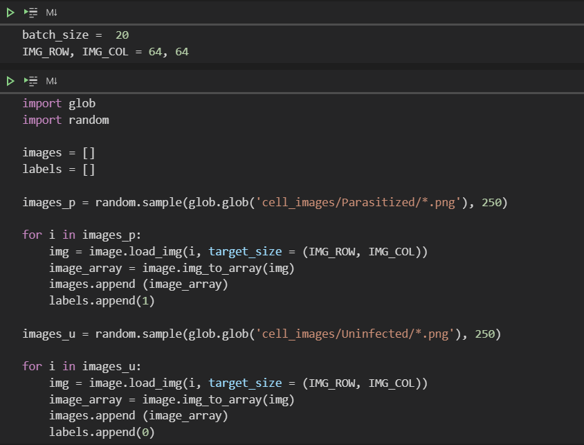
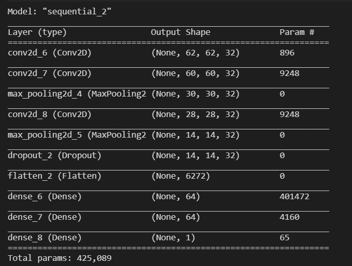
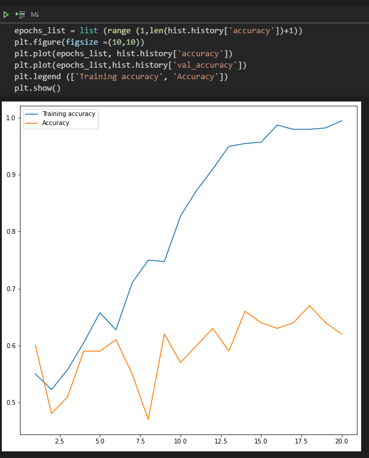
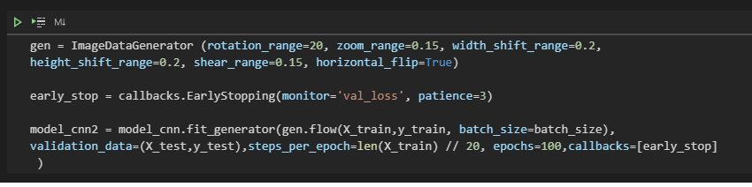
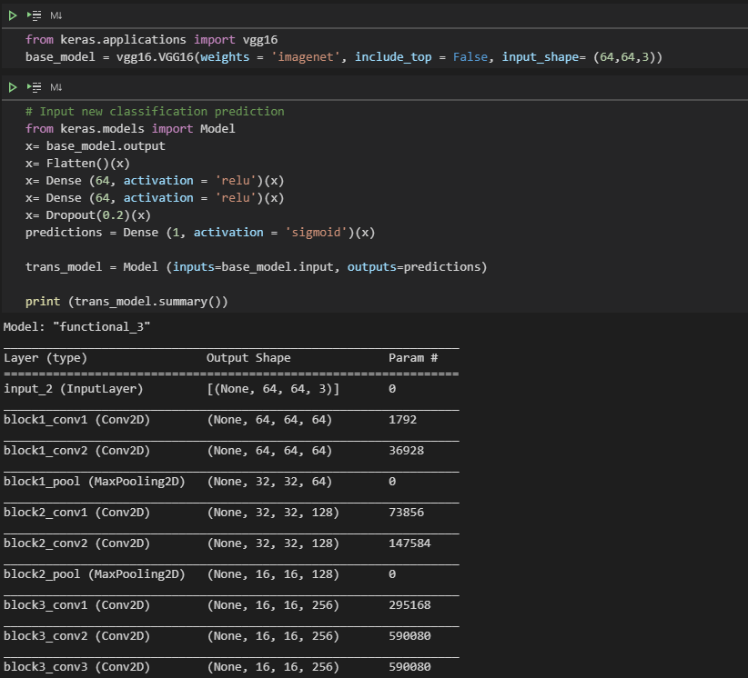
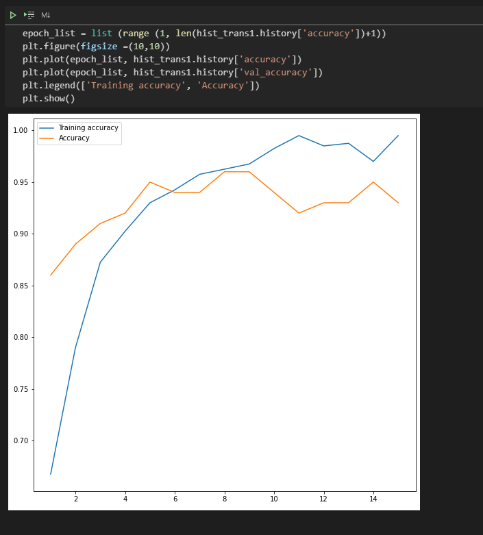

# Exercise-Deep_Learning_Malaria_Dataset

## Aim 
Exploring ways to implement machine learning CNN model on small datasets and to obtain an effective model, by applying Image Data Generator and Transfer Learning (VGG16).  

## Backgroud
#### About the dataset 
The Malaria dataset is frequently used as a practice on implement machine learning model. Malaria is an infectious disease casused by Plasmodium parasites, easily transmitted through mosquito bites. Many fatal cases was happened in Africa due to the poor access to healthcare resources for malaria screenings. To reduce the burden for microscopists in resource-constrained regions and improve diagnostic accuracy, researchers at the Lister Hill National Center for Biomedical Communications (LHNCBC), part of National Library of Medicine (NLM), have developed a mobile application that runs on a standard Android smartphone attached to a conventional light microscope.  

The Malaria dataset contains a total number of 27,558 blood cell images and annotated by expert as infected and uninfected cells. CNN model was commonly choose as it can identify the feature of infected and uninfected cells. However, it tooks around two hours to complete the model training for this simple classification due to the size of the datasets.  

#### About this repository
In real-world setting, it is more often that we may have a small dataset to work with.  
Therefore, I would like to reduce the dataset to 500 images and explore the below two methods that commonly used to improve model performance for small dataset.  
Then, exploring the effect of how they improve the model.
1. Image Data Generator
2. Transfer Learning (VGG16)

## Exploring the dataset 
The repository consist of two folders. There were both 13779 images for 'infected' and 'uninfected' blood cells. 
#### Infected cells sample

#### Uninfected cells sample

## Import images
Images are imported in 64x64 resolution. 250 images are randomly selected from each class and the infected cell images labeled as Class1 while uninfected cell images are Class2. 

The dataset is split to training set and testing set in 80:20 ratio respectively.  

## Basic Convolutional Neural Networks (CNN) 
The basic CNN model consist of three parts. 
Part 1 : Feature Extraction which consist of three convolution layers and two Max Pooling layers. 
Part 2 : Flattening part which can make the model more generalize and prevent over-fitting. 
Part 3 : The model ends with three layers of neuron network for classification function and the activation function 'sigmoid' will predict the image is an infected (as 1) or uninfected (as 0) cell image. 

The below is the code and the structure of the model. 

The basic model trained directly using the random 500 images, with batch_size = 20 and epochs = 20. 

Since the dataset is small and the model is relatively simple, the model is overfitted and the accuracy on the testing set is only 0.6. The below graph is to visualize the training performance.  

#### In the next part, the below two methods applied on the basic model, aimed at improving the model performance and two new models created. 
# Model 1. Image Data Generator
# Model 2. Transfer Learning (VGG16)

## Model 1: Apply ImageDataGenerator
Model 1 applies ImageDataFenerator on the dataset which create random variation on the images. Random rotation, zoom, shift, shear or flip applied on different images and pass througgh the basic CNN model structure.  

ImageDataFenerator improve the model significantly and result for a more generalized model. Both the training accuracy and actual accuracy are reaching simliar accuracy at over 90% and is not overfitting to the training data.  

## Model 2: Apply transfer leaning (VGG16)
Transfer learning is another method that commonly used in machine learning for prediction model training.  The model will reused some parts of a pre-trained model as a starting point of the new model training.  

VGG16 is a CNN model achieves 92.7% top-5 test accuracy in ImageNet, which is a dataset of over 14 million images belonging to 1000 classes. It has a strong feature extraction layer that will be used to replace the first layer of the basic model. The code and structure of Model2 is as below. For the dataset, it remain unchange is the origianl dataset.

Model 2 achieved similar accuracy as Model 1. However, it is interesting to note that the training accuracy is higher than the actual accuracy. The model is slightly overfitted.

## Conclusion
Both ImageDataGenerator and Transfer learning were useful during small dataset training not only to improve the model accuracy, but more important improve the ability to extract image feature and create a more generalized model. 